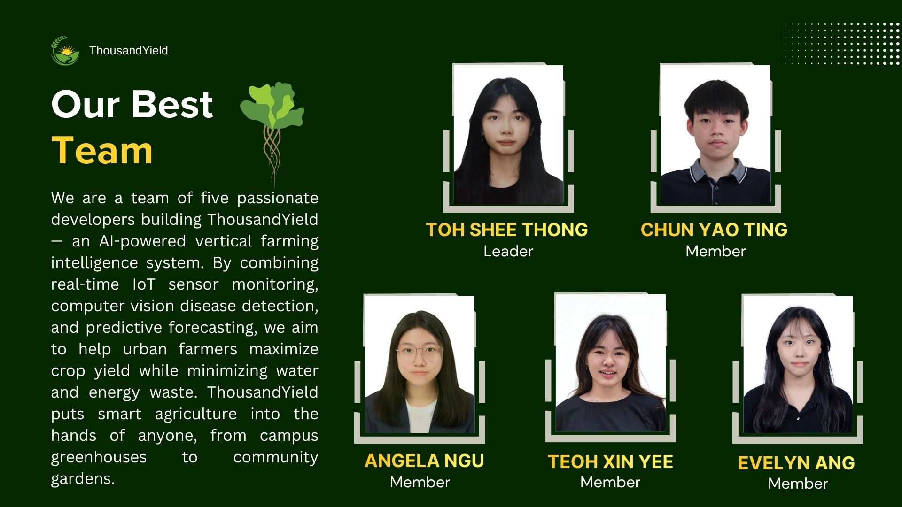
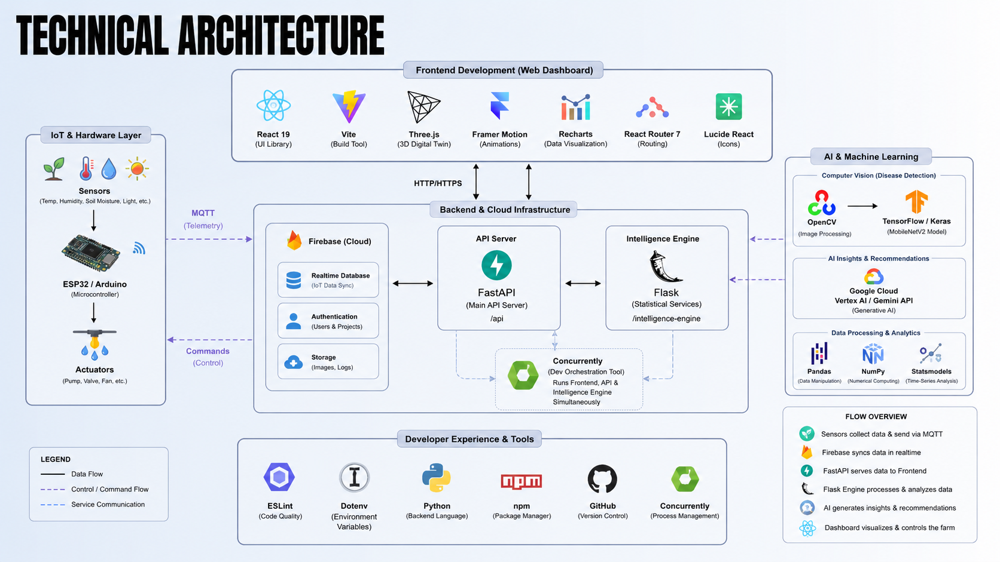

<h1 align="center">ThousandYield — AI Vertical Farming Intelligence</h1>

<p align="center">
  <strong>An AI-powered platform that provides real-time monitoring, computer vision disease detection, and predictive forecasting to help anyone maximize crop yield while minimizing water and energy waste.</strong>
</p>

<p align="center">
  <em><b>Thousand</b> — Abundance and scalability</em> · <em><b>Yield</b> — Agricultural production and efficiency</em><br/>
</p>

<p align="center">
  <b>🎥 <a href="#">Watch our Pitching Video (YouTube)</a></b> •
  <b>📊 <a href="./public/ThousandYield.pdf">View our Prototype Documentation</a></b>
</p>

<br/>

## Team Introduction
We are a team of five passionate developers building ThousandYield — an AI-powered vertical farming intelligence system. By combining real-time IoT sensor monitoring, computer vision disease detection, and predictive forecasting, we aim to help urban farmers maximize crop yield while minimizing water and energy waste. ThousandYield puts smart agriculture into the hands of anyone, from campus greenhouses to community gardens.



| Member | Role | Responsibility |
| :--- | :--- | :--- |
| **Toh Shee Thong** | Leader | **API & Backend Integration**: Developing the API service, connecting sensor data to the frontend, and managing database/state synchronization. |
| **Angela Ngu Xin Yi** | Member | **AI Models & Computer Vision**: Developing image processing for disease detection, health scoring algorithms, and AI recommendation logic. |
| **Chun Yao Ting** | Member | **Frontend & 3D Visualization**: Developing the React UI, interactive dashboard widgets, Recharts data visualization, and the 3D Virtual Farm view (Three.js). |
| **Evelyn Ang** | Member | **Backend Architecture & Weather API**: Developing the Python intelligence engine framework, integrating weather forecasting APIs, and managing data pipelines. |
| **Teoh Xin Yee** | Member | **Core Logic & Automation**: Implementing automated control systems for LED lighting, cooling fans, and hydroponic pumps based on plant profiles. |

---
## Project Overview

### Problem Statement
-   **Overwhelmed by Urbanization**: Rapid urbanization and climate change are pushing traditional food systems beyond their limits.
-   **Too Complex to Manage**: Manual vertical farm management is costly, inconsistent, and prone to human error.
-   **Crops Suffer Without Automation**: Inconsistent lighting, poor nutrient delivery, and uncontrolled climate conditions lead to crop failure and wasted resources.
-   **Tools Are Out of Reach**: Precision agriculture technology remains largely inaccessible and unaffordable for everyday urban farmers.

### SDG Alignment
-   **SDG 2 (Zero Hunger)** — Unreliable systems fail to provide consistent, year-round food security in urban areas.
-   **SDG 11 (Sustainable Cities)** — Absence of local production increases dependence on long-distance supply chains.
-   **SDG 12 (Responsible Consumption)** — Unoptimized farms waste significant water and energy.
-   **SDG 13 (Climate Action)** — Manual farms lack the resilience to adapt to environmental fluctuations driven by climate change.

### Solution Description
Our system integrates IoT-enabled hardware with a sophisticated software dashboard to provide real-time monitoring and autonomous control over critical environmental variables like pH levels, spectrum-specific lighting, and hydroponic nutrient delivery. By synthesizing raw sensor data into actionable AI-driven insights, ThousandYield transforms the complex science of vertical farming into a user-friendly, automated process that maximizes crop health and yield with minimal human intervention.
-   **AI-Augmented Precision** — Smarter crops, better harvests.
-   **Hyper-Resource Optimization** — Grow more, waste less.
-   **Universal Scalability** — Fits any farm, any size.
-   **Integrated Multi-Platform Control** — Full control, anywhere, anytime.

---
## Key Features
-   **Real-Time Monitoring**: Live tracking of temperature, humidity, soil moisture, and pH.
-   **Automated Control**: Smart adjustments for LED spectrums, fans, and hydroponic pumps.
-   **AI Recommendation Engine**: Suggestions for optimal harvest times and nutrient mixtures.
-   **Computer Vision (CCTV)**: Real-time plant health scoring and disease detection.
-   **Resource Optimization**: Detailed tracking and budgeting for electricity and water usage.

---
## Technology Architecture

<div align="center">
  
</div>

### Technology Used
- **Frontend**: React 19, Vite, Three.js (3D Digital Twin), Framer Motion, Recharts, React Router 7, Lucide React.
- **Backend & Cloud**: FastAPI (Main API), Flask (Statistical Services), Firebase (Realtime Database, Auth, Storage), Concurrently.
- **IoT & Hardware**: ESP32/Arduino, Sensors & Actuators, MQTT Telemetry.
- **AI & Machine Learning**: OpenCV, TensorFlow/Keras (MobileNetV2), Google Cloud Vertex AI / Gemini API, Pandas, NumPy, Statsmodels.

### Hardware Implementation
Based on the project's hardware setup, the following components are integrated with the ESP32 gateway (Detailed documentation available in the [Hardware Implementation PDF](./public/Hardware%20Implementation.pdf)):

| Component | Model/Type | Connection / Protocol | Purpose |
| :--- | :--- | :--- | :--- |
| **Microcontroller** | ESP32 | Main Gateway (Wi-Fi) | Processes sensor data and controls actuators. |
| **Temp & Humidity** | DHT22 | GPIO 4 | Measures ambient temperature and relative humidity. |
| **Power Monitoring** | SCT-013 | ADC Pin | Measures total electricity usage of the farm. |
| **Water Level** | HC-SR04 | Trig: GPIO 5, Echo: GPIO 18 | Monitors water level in the storage tank. |
| **Soil Moisture** | Capacitive v1.2 | ADC Pin (e.g., GPIO 34) | Measures moisture level in the root zone. |
| **Nutrient Level** | EC Sensor | Analog Pin (e.g., GPIO 32/35) | Measures electrical conductivity (nutrients). |
| **Light Intensity** | BH1750 | I2C (SDA: 21, SCL: 22) | Measures light brightness in Lux. |
| **Control System** | 5V Relay Module | GPIO 13 | Controls the Solenoid Valve for the sprayer. |

---
## System Feasibility & Scalability

### System Feasibility
- **Technical Feasibility**: Uses accessible hardware (ESP32/Arduino) and lightweight edge models (MobileNetV2) for on-device processing. Cloud sync via Firebase ensures low latency.
- **Economic Feasibility**: Reduces operational costs (water/electricity) by up to 30%, making it cost-effective for SMEs.
- **Operational Feasibility**: The intuitive, glassmorphic dashboard removes the need for advanced technical skills, making it accessible to any urban farmer.

### Scalability
- **Edge Scalability**: Modular hardware design allows new racks to be added independently with minimal configuration.
- **Software Scalability**: FastAPI and Firebase can scale from a single user to a distributed network of community farms.

---
## Business & Impact

### Market Segments
- **SME Urban Farms**: Restaurants & Food Tech Companies. Harvest estimator gives small business owners a real-time Days-to-Harvest countdown with 90% confidence. Every prediction ThousandYield makes comes with a confidence score to prevents unnecessary panic adjustments that waste time, nutrients, and money.
- **Government**: Agencies & Research Labs. Directly supports the MyDIGITAL and DAN 2.0 by providing a "Ready-to-Deploy" framework for Closed-Loop Automation. Tracking of electricity usage and water consumption helps to keep their operational costs low and profit margins high.
- **Academic**: Universities & Campus Greenhouses. Uses explainable rule-based logic with transparent Moving Average Slopes, allowing researchers to verify and study environmental trends with confidence. Health score analytics provides a quantifiable metric (0-100%) for how climate variables (pH, EC, Temp) directly impact biological growth rates, perfect for academic study.

### Business Model
- **Business-to-Government (B2G)**:
  - SaaS platform licensed to urban farms, restaurants, and food tech companies.
  - Full dashboard access across multiple farm racks.
  - Auto AI disease detection via cameras.
  - Sensor-based "Health Score" monitoring to detect growth decline early. 
  - Custom harvest scheduling and automated yield forecasting.
- **Business-to-Business (B2B)**:
  - Enterprise licensing to agencies (MARDI, Jabatan Pertanian) and research labs.
  - Bulk deployment for national food security initiatives.
  - Fully explainable rule-based AI to align with Malaysia’s MyDIGITAL and National Agrofood Policy 2.0 (DAN 2.0).

### Competitor Analysis
| Criteria | FarmByte | Agroz | FarmERP | ThousandYield |
| :--- | :---: | :---: | :---: | :---: |
| **AI Predictive Alerts** | ❌ | Partial | ❌ | ✅ |
| **AI Disease Detection** | ❌ | ❌ | ❌ | ✅ |
| **Harvest Forecasting** | ❌ | Partial | Partial | ✅ |
| **Real-time Sensor Dashboard** | ✅ | ✅ | ✅ | ✅ |

### Social Impact
- **Hyper-Local Food Security**: Empowers communities to grow fresh produce directly in urban centers, reducing dependence on long supply chains.
- **Education**: Creates opportunities for "urban agritech" roles and serves as an educational tool for schools and universities.
- **Community Health**: Increases access to pesticide-free, nutrient-rich food in "food deserts".
- **Reduced Land Footprint**: Vertical planting dramatically reduces the land area required for crop production, preserving natural habitats and maximizing urban space efficiency.

### Sustainability
- **Water Conservation**: Closed-loop systems reduce water usage by up to 90% compared to traditional farming.
- **Energy Efficiency**: Smart scheduling ensures lights and fans are active only when needed, minimizing carbon footprint.
- **Reduced Food Miles**: Growing food where it is consumed drastically cuts down transportation emissions.

---
## Getting Started

### Prerequisites
-   Node.js (v18 or higher)
-   Python 3.10+

### Installation
1. Clone the repository.
2. Install frontend dependencies:
    ```bash
    npm install
    ```

### Running the Application
Start the development server:
```bash
npm run dev
```

---
## Future Improvements
-   **Predictive Farm Simulation** Scrub a timeline slider to preview a 3D time-lapse of your farm up to 14 days ahead, turning passive monitoring into active harvest planning.
-   **Self-Evolving Crop Recipes** A genetic algorithm continuously evolves light, irrigation, and temperature variables each cycle to auto-generate optimized growth recipes unique to your seeds and location.
-   **Multi-Modal Deep Diagnosis** Cross-references camera footage, sensor anomalies, and academic research to deliver a precise scientific report with root cause analysis and exact corrective action.